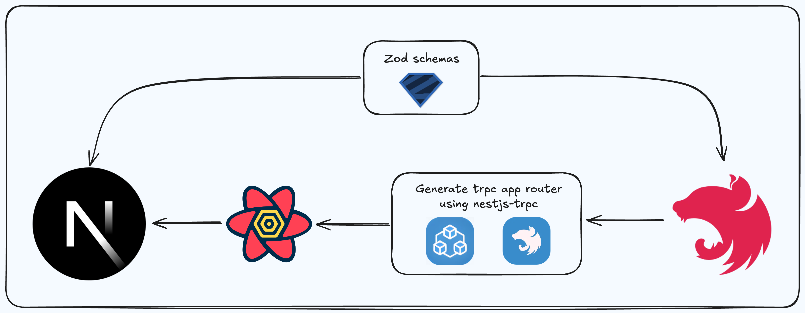
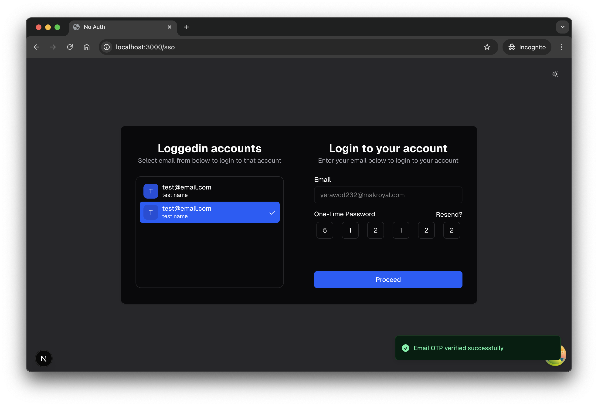
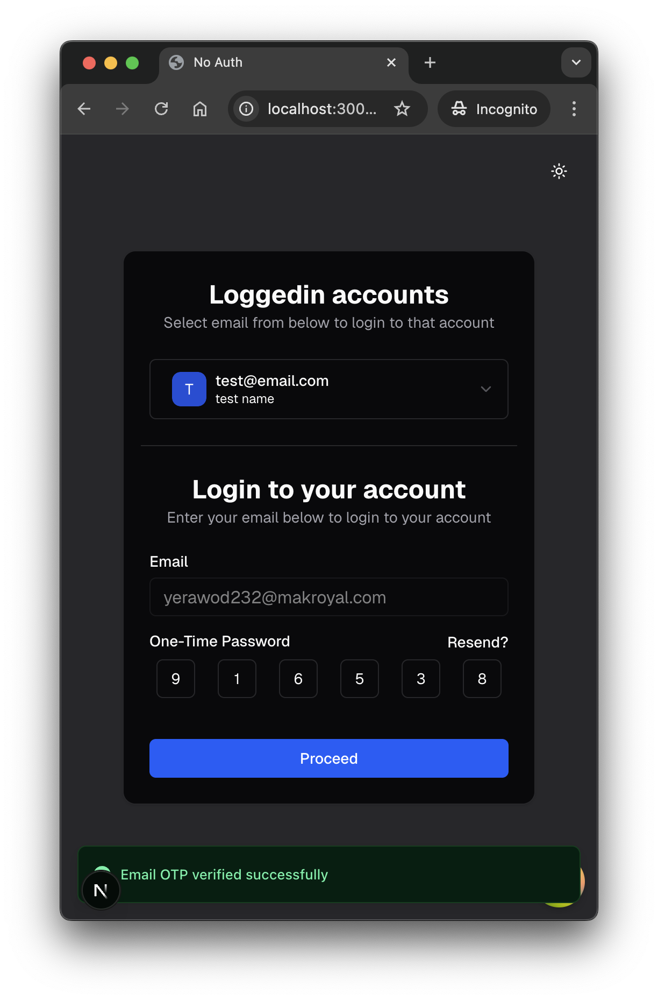

# Motivation

Every application needs Authentication and at some point Authorization, implementing this in each project can be tedious and time consuming. `No Auth` solves this problem for you so, you can focus on other important tasks.

### How to use?

- Clone the repo
- Add env variables, refer env.example
- Goto Root of the frontend in browser example:- localhost:3000
- There is a link to `Go to Single Sign On`, click on it to land on single sign on page
- Verify email and create account or login
- Create new organization
- Open organization page and create sso page from authentication section
- Next go to env tab where you will get all envs for your frontend and backend
- Now, add `@no-auth/next` package, go thru the instructions.
- There is SSO_URL in the frontend env, you can redirect users to that link for login or sign ups, on every new signups system will send user generater `{uuid, email}` to the webhook link(your backend).
- No auth is not managing users yet, so you need to manually store user into your system and all done.
- here 3000 post is used for nextjs frontend and 3001 used for nestjs backend. changing this will need update env as well.

### Features

- Single Sign On(SSO)
- Switch instantly in between loggedin accounts(Multi Tenancy)
- Multi step form for signups, created by drag and drop input components (Next version)
- One time password, Magic link etc via email and whatsapp (Whatsapp next version)
- Create new roles and permissions and authorize your users according to that (Next version)
- Create your own email app for your users communication (Next version)
- Create Templates for messages (Next version)

## Technologies

- Next.js as frontend
- Nest.js as backend
- Zod for schema and type safety
- Nestjs-trpc to generate trpc app router
- tRPC as mode of communication
- Tanstack/React Query as frontend data fetching and state management
- Combining: [Generated tRPC app router](https://www.nestjs-trpc.io/) & [TanStack Query-native](https://trpc.io/docs/client/tanstack-react-query/setup)
- Shadcn/ui for frontend component
- Turborepo

## Flow



## Single Sign On




## Folder structure

```
- root
  - apps
    - api
      - src
        - app
        - database
        - env
        - trpc
        - utils
    - web
      - src
        - app
        - components
        - env
        - hooks
        - public
        - trpc
          - routers
        - utils
  - libs
    - trpc
      - @generated
      - schemas
  - packages
    - eslint-config
    - typescript-config
    - ui
```

## Contribution

Open for developers to contribute. Create an issue and addd your findings regarding of bug or new features requests.

your work should be in your own branch created from issues with prefix like fix, bugfix, refactor /{issue-number}-{issue-desc}.
example: `feat/1-add-whatsapp-feature`

You should add commit messages as per [conventional commit rules.](https://www.conventionalcommits.org/)

### Process

1. Install all npm packages
2. Check the `env.example` file and add your env variables
3. All the commands that affects entire repo like `format` or `pnpm install` should be executed from the root
4. To run individual(api or web) go the their path `cd apps/api` or `cd apps/web`
5. For commit use `cz` command or `git cz` for conventional commits
6. Create PR to master and wait for reviews.
